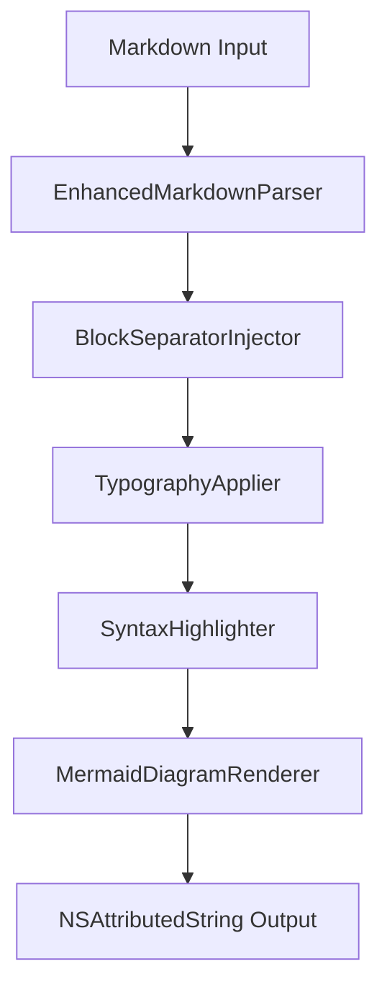
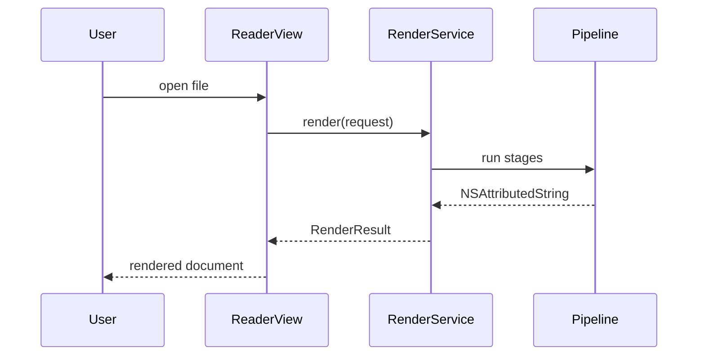
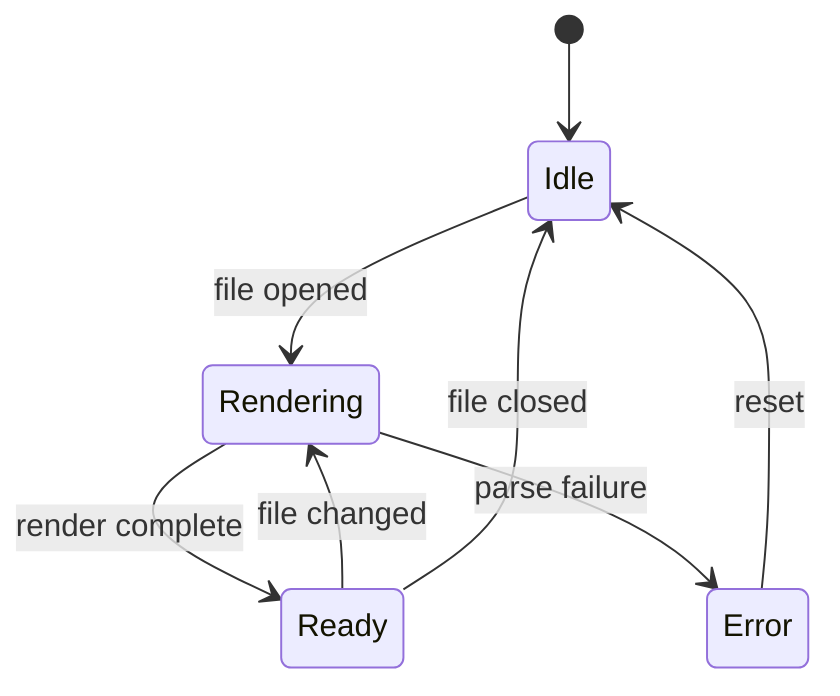

# Mermaid Diagrams

## Flowchart

```mermaid
flowchart TD
    A[Markdown Input] --> B[EnhancedMarkdownParser]
    B --> C[BlockSeparatorInjector]
    C --> D[TypographyApplier]
    D --> E[SyntaxHighlighter]
    E --> F[MermaidDiagramRenderer]
    F --> G[NSAttributedString Output]
```

## Sequence Diagram

```mermaid
sequenceDiagram
    participant User
    participant ReaderView
    participant RenderService
    participant Pipeline

    User->>ReaderView: open file
    ReaderView->>RenderService: render(request)
    RenderService->>Pipeline: run stages
    Pipeline-->>RenderService: NSAttributedString
    RenderService-->>ReaderView: RenderResult
    ReaderView-->>User: rendered document
```

## State Diagram

```mermaid
stateDiagram-v2
    [*] --> Idle
    Idle --> Rendering: file opened
    Rendering --> Ready: render complete
    Ready --> Rendering: file changed
    Ready --> Idle: file closed
    Rendering --> Error: parse failure
    Error --> Idle: reset
```
